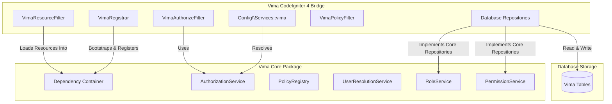

# Vima Core Architecture

Vima PHP is designed under a decoupled, contract-first Domain-Driven Design (DDD) architecture. The engine separates access evaluation algorithms from persistent database models and frameworks.

## Technical Block Diagram

---

## 1. Domain-Driven Design (DDD)

Vima Core is organized into isolated domain folders under `src/` (such as `Role/`, `Permission/`, `Policy/`, `User/`). Each domain contains:
- **`Contracts/`**: Strict interfaces defining boundaries (e.g. `RoleRepositoryInterface`).
- **`Entities/`**: Domain entity POPOs (Plain Old PHP Objects) containing schema-agnostic properties (e.g. `Role`, `Permission`).
- **`Services/`**: Stateless handlers containing operational logic (e.g. `RoleService`, `PermissionService`).
- **`Fluent/`**: Resource builders facilitating chaining syntax (e.g. `RoleResource`).
- **`Exceptions/`**: Domain-specific logic errors.

---

## 2. Core Dependency Injection (PSR-11 Container)

At the heart of the engine is a simple, custom dependency injection container with autowiring:
- Location: `Vima\Core\Support\Discovery\Container`
- Framework adapters bootstrap Vima Core using `CoreBootstrapper::bootstrap($container)`, then overwrite interface bindings with concrete framework storage drivers or configuration objects.

---

## 3. The Facade Pattern (`Vima\Core\Vima`)

The `Vima\Core\Vima` class acts as a global entry point and distinguishes contextual singular resource methods from bulk plural operations:
- **Singular/Contextual**: `Vima::user($user)` or `Vima::role($name)` return fluent builders to perform actions on a specific entity.
- **Plural/Global**: `Vima::roles()` or `Vima::permissions()` return base domain services for operations like `all()`, `create()`, or `save()`.
- **Policies**: `Vima::policies()` accesses the ABAC registry.
